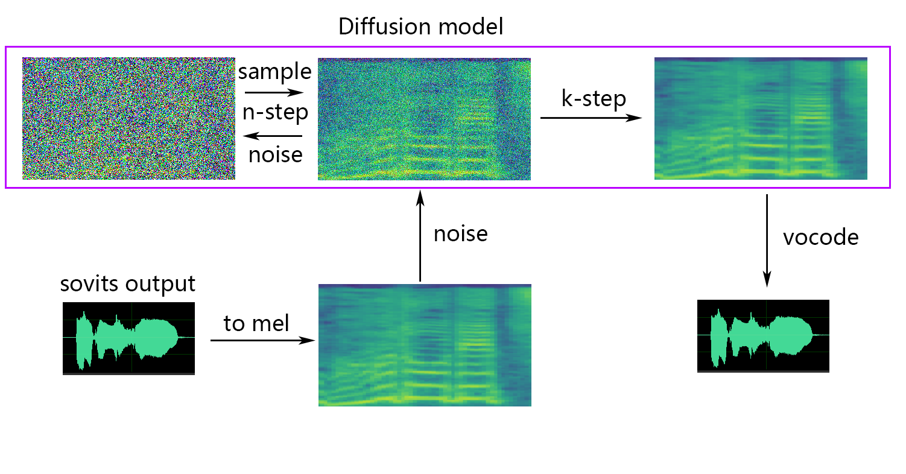

# SoftVC VITS Singing Voice Conversion

[**English**](./README.md) | [**中文简体**](./README_zh_CN.md)

#### ✨ A studio that contains f0 curve editor, speaker mix timeline editor and other features (The purpose of the Onnx model) : [MoeVoiceStudio(Comming soon)](https://github.com/NaruseMioShirakana/MoeVoiceStudio)

#### ✨ A fork with a greatly improved interface: [34j/so-vits-svc-fork](https://github.com/34j/so-vits-svc-fork)

#### ✨ A client supports real-time conversion: [w-okada/voice-changer](https://github.com/w-okada/voice-changer)

#### This project is fundamentally different from Vits. Vits is TTS and this project is SVC. TTS cannot be carried out in this project, and Vits cannot carry out SVC, and the two project models are not universal

## Announcement

The project was developed to allow the developers' favorite anime characters to sing, Anything involving real people is a departure from the intent of the developer.

## Disclaimer

This project is an open source, offline project, and all members of SvcDevelopTeam and all developers and maintainers of this project (hereinafter referred to as contributors) have no control over this project.  The contributor of this project has never provided any organization or individual with any form of assistance, including but not limited to data set extraction, data set processing, computing support, training support, infering, etc.  Contributors to the project do not and cannot know what users are using the project for.  Therefore, all AI models and synthesized audio based on the training of this project have nothing to do with the contributors of this project.  All problems arising therefrom shall be borne by the user.

This project is run completely offline and cannot collect any user information or obtain user input data. Therefore, contributors to this project are not aware of all user input and models and therefore are not responsible for any user input.

This project is only a framework project, which does not have the function of speech synthesis itself, and all the functions require the user to train the model themselves. Meanwhile, there is no model attached to this project, and any secondary distributed project has nothing to do with the contributors of this project

## 📏 Terms of Use

# Warning: Please solve the authorization problem of the dataset on your own. You shall be solely responsible for any problems caused by the use of non-authorized datasets for training and all consequences thereof.The repository and its maintainer, svc develop team, have nothing to do with the consequences!

1. This project is established for academic exchange purposes only and is intended for communication and learning purposes. It is not intended for production environments. 
2. Any videos based on sovits that are published on video platforms must clearly indicate in the description that they are used for voice changing and specify the input source of the voice or audio, for example, using videos or audios published by others and separating the vocals as input source for conversion, which must provide clear original video or music links. If your own voice or other synthesized voices from other commercial vocal synthesis software are used as the input source for conversion, you must also explain it in the description.
3. You shall be solely responsible for any infringement problems caused by the input source. When using other commercial vocal synthesis software as input source, please ensure that you comply with the terms of use of the software. Note that many vocal synthesis engines clearly state in their terms of use that they cannot be used for input source conversion.
4. It is forbidden to use the project to engage in illegal activities, religious and political activities. The project developers firmly resist the above activities. If they do not agree with this article, the use of the project is prohibited.
5. Continuing to use this project is deemed as agreeing to the relevant provisions stated in this repository README. This repository README has the obligation to persuade, and is not responsible for any subsequent problems that may arise.
6. If you use this project for any other plan, please contact and inform the author of this repository in advance. Thank you very much.

## 🆕 Update!

> Updated the 4.0-v2 model, the entire process is the same as 4.0. Compared to 4.0, there is some improvement in certain scenarios, but there are also some cases where it has regressed. Please refer to the [4.0-v2 branch](https://github.com/svc-develop-team/so-vits-svc/tree/4.0-v2) for more information.

## 📝 Model Introduction

The singing voice conversion model uses SoftVC content encoder to extract source audio speech features, then the vectors are directly fed into VITS instead of converting to a text based intermediate; thus the pitch and intonations are conserved. Additionally, the vocoder is changed to [NSF HiFiGAN](https://github.com/openvpi/DiffSinger/tree/refactor/modules/nsf_hifigan) to solve the problem of sound interruption.

### 🆕 4.0-Vec768-Layer12 Version Update Content

- Feature input is changed to [Content Vec](https://github.com/auspicious3000/contentvec) Transformer output of 12 layer, the branch is not compatible with 4.0 model
- Update the shallow diffusion, you can use the shallow diffusion model to improve the sound quality
  
### 🆕 Questions about compatibility with the 4.0 model

- You can support the 4.0 model by modifying the config.json of the 4.0 model, adding the speech_encoder field to the Model field of config.json, see below for details

```
  "model": {
    .........
    "ssl_dim": 768,
    "n_speakers": 200,
    "speech_encoder":"vec256l9"
  }
```

### 🆕 About shallow diffusion


## 💬 About Python Version

After conducting tests, we believe that the project runs stably on `Python 3.8.9`.

## 📥 Pre-trained Model Files

#### **Required**

**The following encoder needs to select one to use**

##### **1. If using contentvec as sound encoder**

- ContentVec: [checkpoint_best_legacy_500.pt](https://ibm.box.com/s/z1wgl1stco8ffooyatzdwsqn2psd9lrr)
  - Place it under the `pretrain` directory

```shell
# contentvec
wget -P pretrain/ http://obs.cstcloud.cn/share/obs/sankagenkeshi/checkpoint_best_legacy_500.pt
# Alternatively, you can manually download and place it in the hubert directory
```

##### **2. If hubertsoft is used as the sound encoder**
- soft vc hubert：[hubert-soft-0d54a1f4.pt](https://github.com/bshall/hubert/releases/download/v0.1/hubert-soft-0d54a1f4.pt)
  - Place it under the `pretrain` directory


#### **Optional(Strongly recommend)**

- Pre-trained model files: `G_0.pth` `D_0.pth`
  - Place them under the `logs/44k` directory

- Diffusion model pretraining base model file: `model_0.pt`
  - Put it in the `logs/44k/diffusion` directory

Get them from svc-develop-team(TBD) or anywhere else.

Although the pretrained model generally does not cause any copyright problems, please pay attention to it. For example, ask the author in advance, or the author has indicated the feasible use in the description clearly.

#### **Optional(Select as Required)**

If you are using the `NSF-HIFIGAN enhancer` or `shallow diffusion`, you will need to download the pre-trained NSF-HIFIGAN model, or not if you do not need it.

- Pre-trained NSF-HIFIGAN Vocoder: [nsf_hifigan_20221211.zip](https://github.com/openvpi/vocoders/releases/download/nsf-hifigan-v1/nsf_hifigan_20221211.zip)
  - Unzip and place the four files under the `pretrain/nsf_hifigan` directory

```shell
# nsf_hifigan
wget -P pretrain/ https://github.com/openvpi/vocoders/releases/download/nsf-hifigan-v1/nsf_hifigan_20221211.zip
# Alternatively, you can manually download and place it in the pretrain/nsf_hifigan directory
# URL：https://github.com/openvpi/vocoders/releases/tag/nsf-hifigan-v1
```

## 📊 Dataset Preparation

Simply place the dataset in the `dataset_raw` directory with the following file structure.

```
dataset_raw
├───speaker0
│   ├───xxx1-xxx1.wav
│   ├───...
│   └───Lxx-0xx8.wav
└───speaker1
    ├───xx2-0xxx2.wav
    ├───...
    └───xxx7-xxx007.wav
```

You can customize the speaker name.

```
dataset_raw
└───suijiSUI
    ├───1.wav
    ├───...
    └───25788785-20221210-200143-856_01_(Vocals)_0_0.wav
```

## 🛠️ Preprocessing

### 0. Slice audio

Slice to `5s - 15s`, a bit longer is no problem. Too long may lead to `torch.cuda.OutOfMemoryError` during training or even pre-processing.

By using [audio-slicer-GUI](https://github.com/flutydeer/audio-slicer) or [audio-slicer-CLI](https://github.com/openvpi/audio-slicer)

In general, only the `Minimum Interval` needs to be adjusted. For statement audio it usually remains default. For singing audio it can be adjusted to `100` or even `50`.

After slicing, delete audio that is too long and too short.

### 1. Resample to 44100Hz and mono

```shell
python resample.py
```

### 2. Automatically split the dataset into training and validation sets, and generate configuration files.

```shell
python preprocess_flist_config.py --speech_encoder vec768l12
```

speech_encoder has three choices

```
vec768l12
vec256l9
hubertsoft
```

If the speech_encoder argument is omitted, the default value is vec768l12


### 3. Generate hubert and f0

```shell
python preprocess_hubert_f0.py --f0_predictor dio
```

f0_predictor has four options

```
crepe
dio
pm
harvest
```

If the training set is too noisy, use crepe to handle f0

If the f0_predictor parameter is omitted, the default value is dio

If you want shallow diffusion (optional), you need to add the --use_diff parameter, for example

```shell
python preprocess_hubert_f0.py --f0_predictor dio --use_diff
```

After completing the above steps, the dataset directory will contain the preprocessed data, and the dataset_raw folder can be deleted.

#### You can modify some parameters in the generated config.json and diffusion.yaml

* `keep_ckpts`: Keep the last `keep_ckpts` models during training. Set to `0` will keep them all. Default is `3`.

* `all_in_mem`: Load all dataset to RAM. It can be enabled when the disk IO of some platforms is too low and the system memory is **much larger** than your dataset.

## 🏋️‍♀️ Training

### Diffusion Model (optional)

If the shallow diffusion function is needed, the diffusion model needs to be trained. The diffusion model training method is as follows:

```shell
python train_diff.py -c configs/diffusion.yaml
```

### Sovits Model

```shell
python train.py -c configs/config.json -m 44k
```

After the model training, the model file is saved in the directory `logs/44k`, and the diffusion model is stored under `logs/44k/diffusion`

## 🤖 Inference

Use [inference_main.py](https://github.com/svc-develop-team/so-vits-svc/blob/4.0/inference_main.py)

```shell
# Example
python inference_main.py -m "logs/44k/G_30400.pth" -c "configs/config.json" -n "君の知らない物語-src.wav" -t 0 -s "nen"
```

Required parameters:
- `-m` | `--model_path`: path to the model.
- `-c` | `--config_path`: path to the configuration file.
- `-n` | `--clean_names`: a list of wav file names located in the raw folder.
- `-t` | `--trans`: pitch adjustment, supports positive and negative (semitone) values.
- `-s` | `--spk_list`: target speaker name for synthesis.
- `-cl` | `--clip`: voice forced slicing, set to 0 to turn off(default), duration in seconds.

Optional parameters: see the next section
- `-lg` | `--linear_gradient`: The cross fade length of two audio slices in seconds. If there is a discontinuous voice after forced slicing, you can adjust this value. Otherwise, it is recommended to use the default value of 0.
- `-f0p` | `--f0_predictor`: Select F0 predictor, can select crepe,pm,dio,harvest, default pm(note: crepe is original F0 meaning pooling)
- `-a` | `--auto_predict_f0`: automatic pitch prediction for voice conversion, do not enable this when converting songs as it can cause serious pitch issues.
- `-cm` | `--cluster_model_path`: path to the clustering model, fill in any value if clustering is not trained.
- `-cr` | `--cluster_infer_ratio`: proportion of the clustering solution, range 0-1, fill in 0 if the clustering model is not trained.
- `-eh` | `--enhance`: Whether to use NSF_HIFIGAN enhancer, this option has certain effect on sound quality enhancement for some models with few training sets, but has negative effect on well-trained models, so it is turned off by default.
- `-shd` | `--shallow_diffusion`：Whether to use shallow diffusion, which can solve some electrical sound problems after use. This option is turned off by default. When this option is enabled, NSF_HIFIGAN intensifier will be disabled

Shallow diffusion setting
+ `-dm` | `--diffusion_model_path`：Diffusion model path
+ `-dc` | `--diffusion_config_path`：Diffusion model profile path
+ `-ks` | `--k_step`：The larger the number of diffusion steps, the closer it is to the result of the diffusion model. The default is 100
+ `-od` | `---only_diffusion`：Only diffusion mode, which does not load the sovits model to the diffusion model inference


## 🤔 Optional Settings

If the results from the previous section are satisfactory, or if you didn't understand what is being discussed in the following section, you can skip it, and it won't affect the model usage. (These optional settings have a relatively small impact, and they may have some effect on certain specific data, but in most cases, the difference may not be noticeable.)

### Automatic f0 prediction

During the 4.0 model training, an f0 predictor is also trained, which can be used for automatic pitch prediction during voice conversion. However, if the effect is not good, manual pitch prediction can be used instead. But please do not enable this feature when converting singing voice as it may cause serious pitch shifting!
- Set `auto_predict_f0` to true in inference_main.

### Cluster-based timbre leakage control

Introduction: The clustering scheme can reduce timbre leakage and make the trained model sound more like the target's timbre (although this effect is not very obvious), but using clustering alone will lower the model's clarity (the model may sound unclear). Therefore, this model adopts a fusion method to linearly control the proportion of clustering and non-clustering schemes. In other words, you can manually adjust the ratio between "sounding like the target's timbre" and "being clear and articulate" to find a suitable trade-off point.

The existing steps before clustering do not need to be changed. All you need to do is to train an additional clustering model, which has a relatively low training cost.

- Training process:
  - Train on a machine with good CPU performance. According to my experience, it takes about 4 minutes to train each speaker on a Tencent Cloud machine with 6-core CPU.
  - Execute `python cluster/train_cluster.py`. The output model will be saved in `logs/44k/kmeans_10000.pt`.
  - The clustering model can currently be trained using the gpu by executing `python cluster/train_cluster.py --gpu`
- Inference process:
  - Specify `cluster_model_path` in `inference_main.py`.
  - Specify `cluster_infer_ratio` in `inference_main.py`, where `0` means not using clustering at all, `1` means only using clustering, and usually `0.5` is sufficient.

### [](https://colab.research.google.com/github/svc-develop-team/so-vits-svc/blob/4.0-Vec768-Layer12/sovits4_for_colab.ipynb) [sovits4_for_colab.ipynb](https://colab.research.google.com/github/svc-develop-team/so-vits-svc/blob/4.0-Vec768-Layer12/sovits4_for_colab.ipynb)

**[23/03/16] No longer need to download hubert manually**

**[23/04/14] Support NSF_HIFIGAN enhancer**

## 📤 Exporting to Onnx

Use [onnx_export.py](https://github.com/svc-develop-team/so-vits-svc/blob/4.0/onnx_export.py)

- Create a folder named `checkpoints` and open it
- Create a folder in the `checkpoints` folder as your project folder, naming it after your project, for example `aziplayer`
- Rename your model as `model.pth`, the configuration file as `config.json`, and place them in the `aziplayer` folder you just created
- Modify `"NyaruTaffy"` in `path = "NyaruTaffy"` in [onnx_export.py](https://github.com/svc-develop-team/so-vits-svc/blob/4.0/onnx_export.py) to your project name, `path = "aziplayer"`（onnx_export_speaker_mix makes you can mix speaker's voice）
- Run [onnx_export.py](https://github.com/svc-develop-team/so-vits-svc/blob/4.0/onnx_export.py)
- Wait for it to finish running. A `model.onnx` will be generated in your project folder, which is the exported model.

Note: For Hubert Onnx models, please use the models provided by MoeSS. Currently, they cannot be exported on their own (Hubert in fairseq has many unsupported operators and things involving constants that can cause errors or result in problems with the input/output shape and results when exported.)

## ☀️ Previous contributors

For some reason the author deleted the original repository. Because of the negligence of the organization members, the contributor list was cleared because all files were directly reuploaded to this repository at the beginning of the reconstruction of this repository. Now add a previous contributor list to README.md.

*Some members have not listed according to their personal wishes.*

<table>
  <tr>
    <td align="center"><a href="https://github.com/MistEO"><br /><sub><b>MistEO</b></sub></a><br /></td>
    <td align="center"><a href="https://github.com/XiaoMiku01"><br /><sub><b>XiaoMiku01</b></sub></a><br /></td>
    <td align="center"><a href="https://github.com/ForsakenRei"><br /><sub><b>しぐれ</b></sub></a><br /></td>
    <td align="center"><a href="https://github.com/TomoGaSukunai"><br /><sub><b>TomoGaSukunai</b></sub></a><br /></td>
    <td align="center"><a href="https://github.com/Plachtaa"><br /><sub><b>Plachtaa</b></sub></a><br /></td>
    <td align="center"><a href="https://github.com/zdxiaoda"><br /><sub><b>zd小达</b></sub></a><br /></td>
    <td align="center"><a href="https://github.com/Archivoice"><br /><sub><b>凍聲響世</b></sub></a><br /></td>
  </tr>
</table>

## 📚 Some legal provisions for reference

#### Any country, region, organization, or individual using this project must comply with the following laws.

#### 《民法典》

##### 第一千零一十九条 

任何组织或者个人不得以丑化、污损，或者利用信息技术手段伪造等方式侵害他人的肖像权。未经肖像权人同意，不得制作、使用、公开肖像权人的肖像，但是法律另有规定的除外。未经肖像权人同意，肖像作品权利人不得以发表、复制、发行、出租、展览等方式使用或者公开肖像权人的肖像。对自然人声音的保护，参照适用肖像权保护的有关规定。

#####  第一千零二十四条 

【名誉权】民事主体享有名誉权。任何组织或者个人不得以侮辱、诽谤等方式侵害他人的名誉权。  

#####  第一千零二十七条

【作品侵害名誉权】行为人发表的文学、艺术作品以真人真事或者特定人为描述对象，含有侮辱、诽谤内容，侵害他人名誉权的，受害人有权依法请求该行为人承担民事责任。行为人发表的文学、艺术作品不以特定人为描述对象，仅其中的情节与该特定人的情况相似的，不承担民事责任。  

#### 《[中华人民共和国宪法](http://www.gov.cn/guoqing/2018-03/22/content_5276318.htm)》

#### 《[中华人民共和国刑法](http://gongbao.court.gov.cn/Details/f8e30d0689b23f57bfc782d21035c3.html?sw=%E4%B8%AD%E5%8D%8E%E4%BA%BA%E6%B0%91%E5%85%B1%E5%92%8C%E5%9B%BD%E5%88%91%E6%B3%95)》

#### 《[中华人民共和国民法典](http://gongbao.court.gov.cn/Details/51eb6750b8361f79be8f90d09bc202.html)》

## 💪 Thanks to all contributors for their efforts
<a href="https://github.com/svc-develop-team/so-vits-svc/graphs/contributors" target="_blank">
  
</a>
